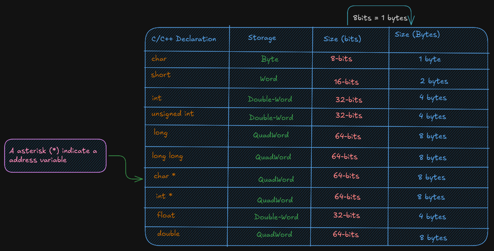
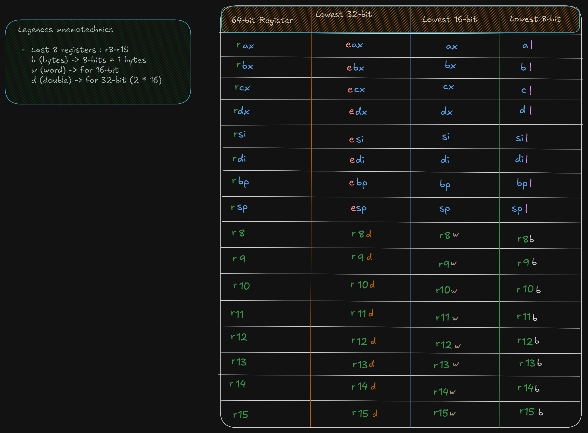
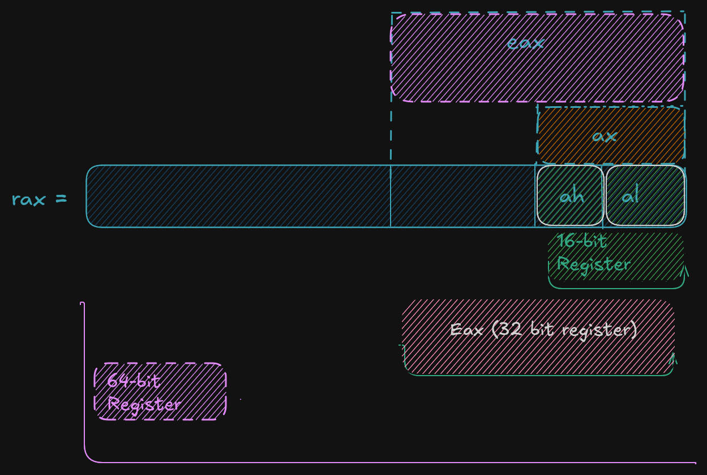
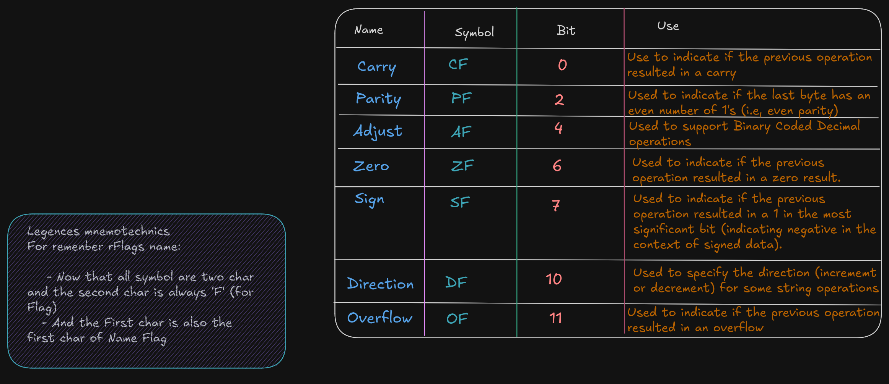
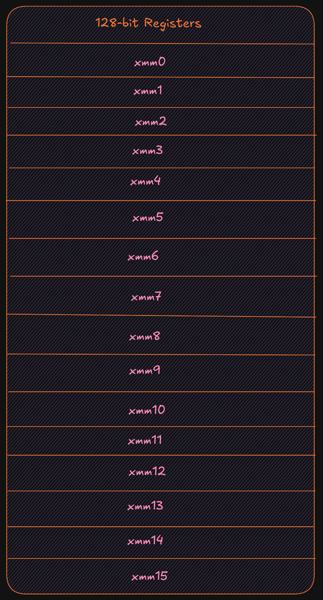
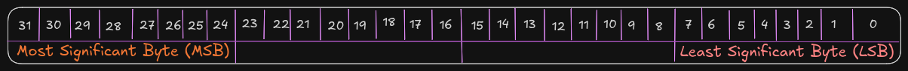
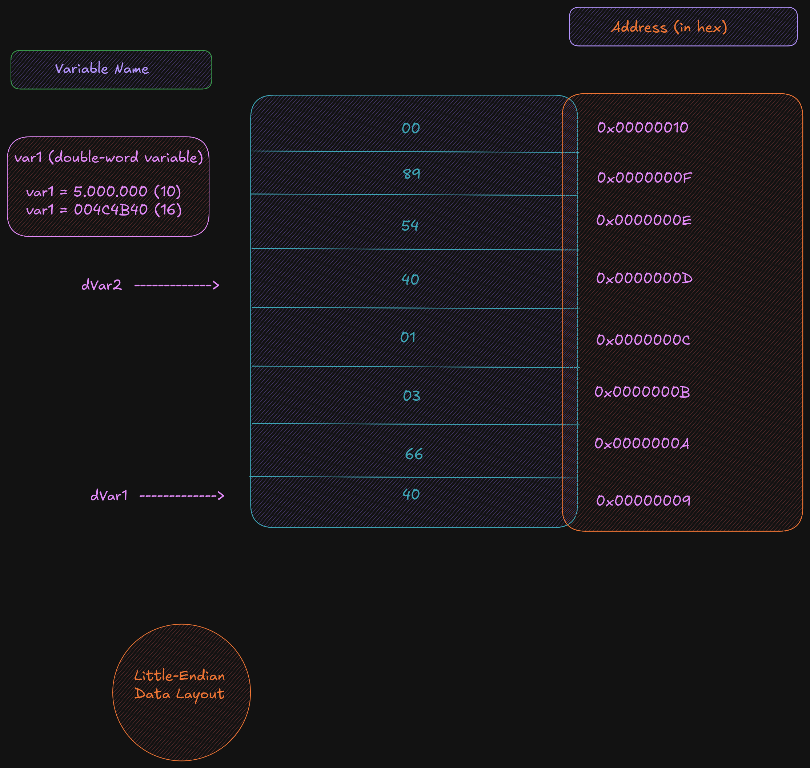
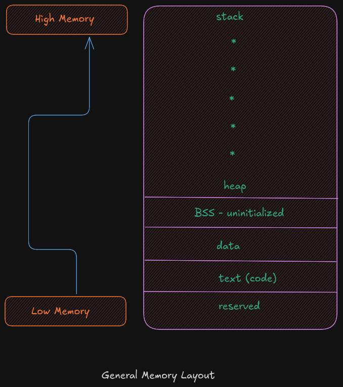
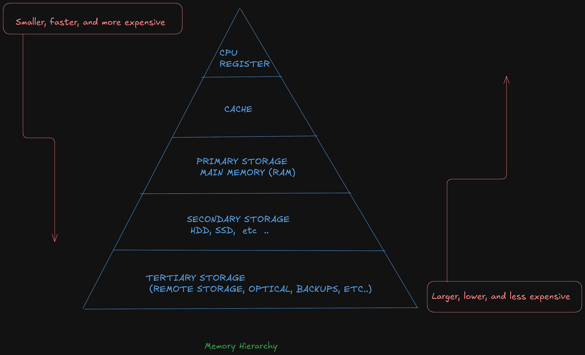
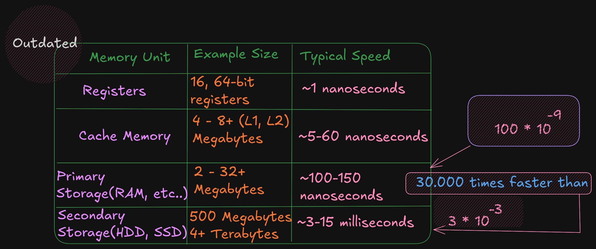

# 2.0 - Architecture Overview


## 2.1 -  
A computer components include a **CPU** (Central Processing Unit), a **RAM** (Random Access Memory),
a storage device (SSD / HDD), input / output devices (screenm keyboard, mouse).


**A Big Picture of Von Neumann Architecture**
 

A **CPU or processor** is a **computer brain** that contains a **Control Unit** (CU), 
main memory, and **Arithmetic Logic Unit** (ALU)
A **CPU** includes all **circuitry** required to **process input, store data, and generate output**.
It also follows **program instructions** that tell it which information
to process and how to process it.

 - **CU** (`Control Unit`): It is responsible for how **data moves throughout the system**, for
redirecting all **input** and **output flow**, and for **fetching instruction code**.

- **ALU** (`Arithmetic and Logic Unit`) : It a part of **CPU** who handles all **computations**
like *addition*, *subtraction*, and *comparisons*, with **logical operations**, **arithmetic operations**
and **bit shifting operation**

- **Register** : It's a sort of highly fast **Computer memory** that is used to *accept*, *store*, and *transport data* 
A **Processor register** is the term used to define the **registers** that **CPU** uses (General Purpose Register) .

- **Accumulator** : It store the result of calculation that **ALU** makes.

- **Program Counter**: The memory address of the next instruction (the instruction that will be executed next).
This next address is passed from the **Program Counter** to the **Memory Address Register**.

- **Memory Address Register** : `MAR` **stores** the **memory address locations** of those instructions 
that are either to be **fetched** from **memory** or to be **stored** in **memory**.

- **Memory Data Register** : `MDR`  **stores** the **instructions** that are **fetched** from **memory**
or any *information* that is to be **transferred to and stored** in the **memory**.

- **Current Instruction Register** : `CIR` **stores** the recently **fetched instructions** while they wait for **execution**.

- **Instruction Buffer Register** : `IBR` is used to hold instructions that are not **immediately executed**.

### Input / Output Devices
  
   The **program or the data** is read into **main memory** (`RAM`) from the **secondary storage** (`HDD`, `SSD`)
   If an result are *evaluated* by a computer and saved in it , you can *present* them to user via **output devices**. 	

   - **Buses**: Data is sent from one part of a computer to another via **buses** which connect all key 
   	internal components to the memory and CPU.

   - **Control Bus**: It receive **control commands** from `CPU`, as well as status signals from **other
   		devices**, and uses them to **control and coordinate** all of the computer's actions.
   - **Address Bus**: It **communicates** between **memory and the processor**  data address (not the actual data)
   - **Data Bus**: It **relays information** between the **memory unit**, **I/O devices**, and the **processor**.

## 2.2 Data Storage Sizes
The **x86-64 architecture** supports a specific set of **data storage size elements**.
The **storage size** are a direct **correlation** to variable declarations in high-level
language (C, C++, Rust)


   


## 	2.3 CPU Registers 
A **CPU Registers** or just **register**, is a *temporary* storage or **working
location** built into the **CPU** itself (separate)
A `64-bit` **General Purpose Registers** (GPRs) are in number of **60**, they can 
be used by all **64-bits** or some *portion* or subset accessed.

When a *data* want to used a element with **sizes** less than **64-bits** (32-bit, 16-bit, or 8-bit)
a specific part of this **less sized register** can be accessed by using a 
different **register name** like described here :

  


As show in the **excalidrw diagram**, the first 4 registers, `rax`, `rbx`, `rcx`,
`rdx` allow to accessed to 8-15 bits with the `ah`, `bh`, `ch`, and `dh` register names.
But `ah` is provided for legacy support.

A register save value the used to affected to them in **hex** base. By exemple if:

```bn
rax = 50.000.000.000 	  # value set to rax in decimal base (10)
rax = 0000 000B A43B 7400 # the eax value is saved in hex base (16)

ax = 50.000 			  # if ax is set to 50.000 in base decimal (10)
ax = C350 				  # the ax calue is save in hex base 	(16)

rax = 0000 000B A43B C350 # each value is 1byte, the total do 16 byte, and each section separate by space do 16-bit
  # the total do 64-bit,  here the lower 16-bit ax of rax is set the upper 48-bits are unaffected
  # Note the change of ax to 7400 (16) to C350 (16)

al = 50					  # al register is set to 50 (10), who is 32 (16) in hex
rax = 0000 000B A43B C332 # when the lower 8-bit al portion of the 64-bit is set the 56-bits are unaffected
```

For **32-bit register operations**, the *upper* 32-bit (first 32-bit from left to right) is set cleared (set to 0)




### RSP (Register Stack Pointer)
A `rsp` is a **register** who is not used for *data* or other uses but it used to point to the **top of the stack**. 

### RBP (Register Base Pointer)
A `rbp` is used as a **base pointer** during functions calls, it her only functions.

### RIP (Register Instruction Pointer)
A 	`rip` is a **special register** used by CPU ro point to the *next instruction* to be executed.
So if `rip` *points* to the *next instruction* means that in *debugger* the `rip` point to a instruction who is not 
*already executed*.
### Flag Register (rFlags)
A **flag register**, `rFlags` is used for store  *status* and `CPU` *control information* about the *instruction* that
was just executed.
The **rFlag**  is *directly updated* (`Status`) by **processor** and not accessible by program,




### XMM registers

The `XMM` are set of **dedicated registers** used to support **32-bit** and **64-bit floating point** 
operations and **Single Instruction Multiple Data** (`SIMD`) instructions.
`SIMD` allow a *single instructions* allow a *single instruction* to be applied
*simultaneaously* to to *multiple data items*, it help to increase a performance.




### Cache Memory

**Cache memory** is a small *subset of the primary storage* or `RAM` located in the
**CPU chip**. If a *memory location* is accessed, a *copy* of the *value* is *placed*
in the cache*.
A **memory read** involves *sending* the *address* via the *bus* to the *memory controller*, 
which will *obtain the value* at the *requested memory location*, and *send it back* 
through *the bus*. Comparatively, if a *value* is in *cache*, it would be much faster 
to *access* that *value*.
A *cache hit* occurs when the *requested data* can be found in a *cache*, while a cache miss
*occurs* when it cannot. **Cache hits** are served by **reading data** from the *cache*, which is
faster than reading from *main memory*. The more requests that can be **served from
cache**, the faster the system will *typically perform*.


## Main memory
 Memory can be viewed as a *series of bytes*, *one after another*. That is, *memory is byte
 addressable*. This means *each memory address* holds *one byte* of information. To *store*
 a **double-word**, **four bytes** are required which use *four memory addresses*.
 Additionally, *architecture* is `little-endian`. This means that the **Least Significant Byte**
 (`LSB`) is *stored* in the **lowest memory address**. The **Most Significant Byte** (`MSB`) is
 stored in the **highest memory location**.
 


For example, assuming the value of, **5,000,000** (`10`) `->` **004C4B40** (`16`), is to be placed in a
**double-word** variable named `var1`.
For a **little-endian** *architecture*, the **memory** picture would be as follows:




Based on the **little-endian** *architecture*, the `LSB` is stored in the *lowest memory address*
and the `MSB` is stored in the *highest memory location*.

## 2.5 Memory Layout

The *general memory layout* for a program is as shown:



The `reserved` *section* is not *available* to *user programs*. The `text` (or code) *section* is
where the *machine language* (i.e., the `1`'s and `0`'s that *represent the code*) is stored. The
`data` section is where the *initialized data* is stored. This includes *declared variables* that
have been provided an *initial value* at *assemble-time*. The uninitialized *data section*,
typically called `BSS` *section*, is where *declared variables* that have *not been provided* an
*initial value* are stored. If *accessed* before being set, the *value* will not be meaningful.
The `heap` is where *dynamically allocated* data will be *stored* (if *requested*). The `stack`
starts in **high memory** and *grows downward*.


## Memory Hierarchy
 
In order to fully understand the various *different memory levels* and *associated usage*, it
is useful to *review* the *memory hierarchy*. In general terms, *faster memory* is more
*expensive* and *slower memory blocks* are *less expensive*. The `CPU` *registers* are *small*,
*fast*, and *expensive*. **Secondary storage devices** such as *disk drives* and *Solid State
Drives* (SSD's) are *larger, slower*, and *less expensive*. The overall goal is to *balance
performance with cost*.
An overview of the memory hierarchy is as follows:



Where the *top* of the *triangle* represents the *fastest, smallest, and most expensive
memory*. As we move down *levels*, the *memory becomes slower*, *larger*, and *less
expensive*. The *goal* is to use an *effective balance between the small*, *fast*, *expensive
memory* and the *large*, *slower*, and *cheaper memory*.




 
Based on this table, a *primary storage access* at *100 nanoseconds*  is 30,000
*times faster* than a *secondary storage* access, at *3 milliseconds* .
The typical speeds improve over time (and these are already *out of date*). The key point
is the relative *difference between* each *memory unit* is *significant*. *This difference*
between *the memory units* applies even as newer, faster SSDs are being utilized.


