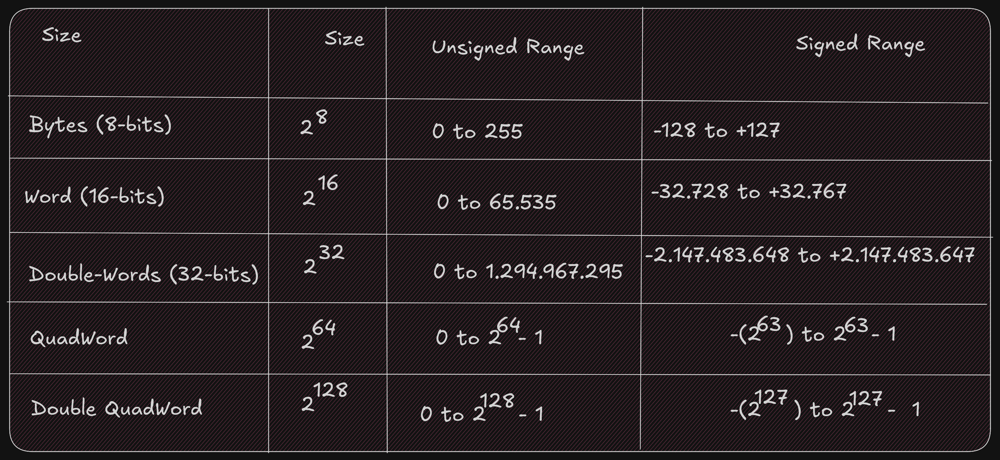
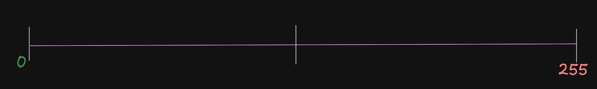
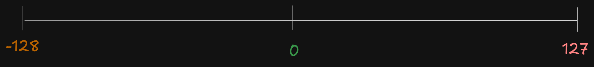
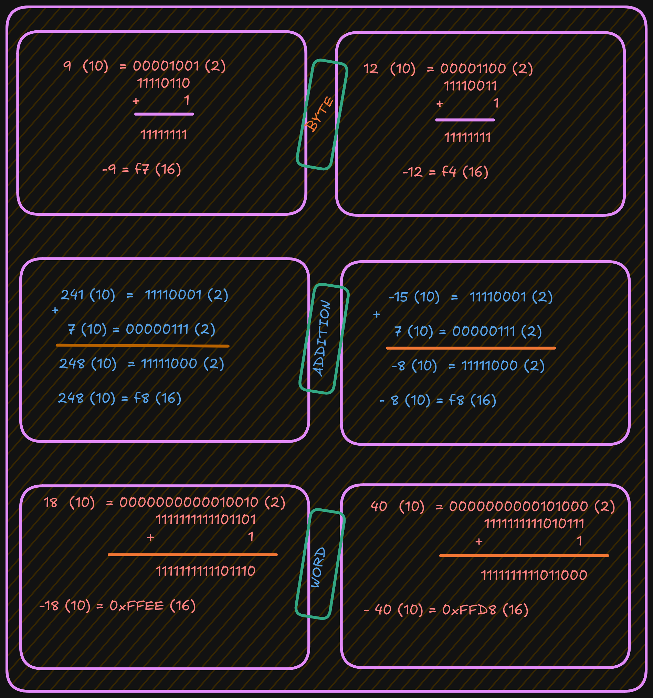
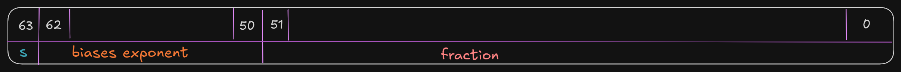
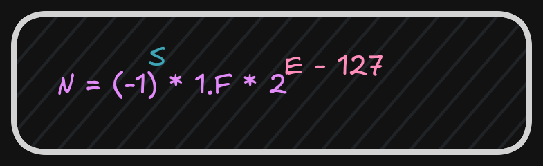
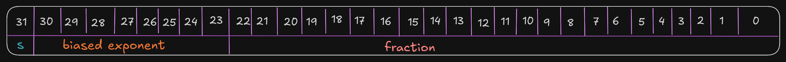
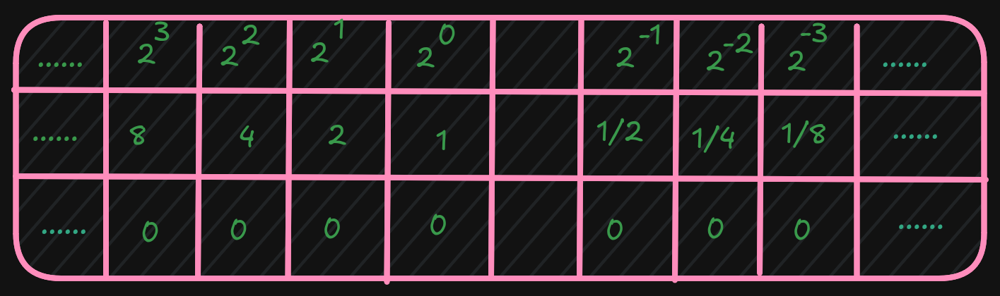
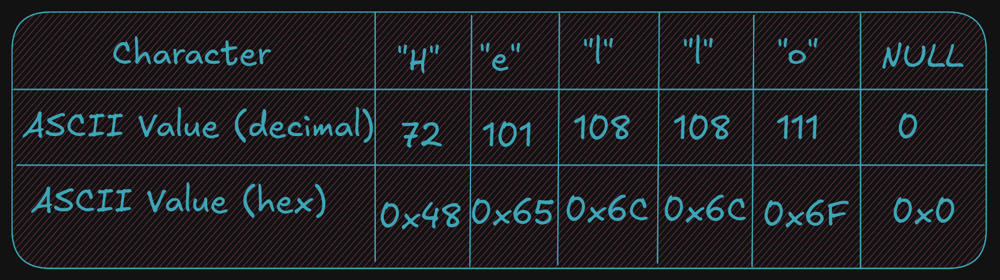
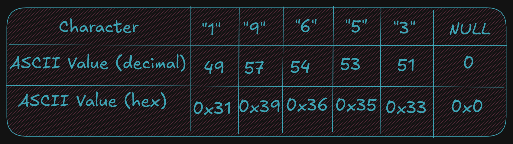

# 3.0 Data Representation

In a computer, data representation is how information is stored. It differs
depending on what you want to store; for example, the method used to store integers
is different from the method used to store floating-point numbers and strings.

Different bases are used here (**binary**, **decimal**, **hex**) to represent a number.
Ex:

 - `19 = 19 (10) = 13 (16) = 0x13`

## 3.1 Integer Representation
The computer represents numbers in binary (1s and 0s). A number or variable can be stored in a limited
amount of space provided by the computer.
This directly impacts the size or range of numbers that can be represented.

Ex:										 
`1 byte (8 bits)` can represent `2^8`, or `256`, different numbers.
These `256` numbers (0-255) can be unsigned (all positive).
The signed range is (-128 to +127).

So if a number that we want to represent need more space to be represented a larger
size must be used. Like :
- A `word` 16-bits for 65.536 (0 - 65.535) for signed and (-32.768 - 32.767) for unsigned value
- A  `double-word` 32-bits for 4.294.967.296 (0 - 4.294.967.295) for signed and (-2.147.483.648 to
+2.147,483,647) for unsigned value

It is important to know whether a value can be represented; you need to know the size of the
storage element (byte, word, double-word, quadword) being used and whether the values
are signed or not.
Signed values use a standard binary representation.
Unsigned values use a **two's complement** representation.

For example, the unsigned byte range can be represented using a number line as follows:

For example, the signed byte range can be represented using a number line as follows:

When we examine a binary file with a debugger, it is difficult to know 
whether a variable in memory is signed or not because unsigned values have a 
different, positive-only range than signed values.

For example, when the unsigned and signed values are within the overlapping positive
range (0 to +127):

- A signed byte representation of 12 (10) is 0x0C (16)
- An unsigned byte representation of 12 (10) is also 0x0C (16)

When the unsigned and signed values are outside the overlapping range:

- A signed byte representation of -15 (10) is 0xF1 (16)
- An unsigned byte representation of 241 (10) is also 0xF1 (16)

Note: if your number contains a group of 4 bits (`1111`), that is `15` in decimal.

### Two's Complement
To find a **two's-complement** representation for negative values:

1. Take the one's complement (negate all bits).
2. Add `1` (binary addition).

For example, to represent `-9`:

- Start with the positive value `9`.
- Convert it to binary.
- Invert all bits (change `1` to `0` and `0` to `1`).
- Add `1`.

See the example below:

 
## 3.3 Floating-point Representation

The representation of floating-point numbers differs by format.
The representation shown here is **IEEE 754** 32-bit **floating-point**

Where s is the sign (`0` => *positive* and `1` => negat*ive). More formally, this can be written as;

After these calculations, the next step is to calculate the biased exponent,
which is the exponent from the normalized scientific notation plus the bias. 

The value for the `IEEE 32-bit` **floating-point** standard is **127**, and
the result should be converted to 8 bits (1 byte) and stored in the biased exponent portion of the word.

A 64-bit floating-point standard representation is the same as 32-bit,
however the format allows an `11-bit` biased exponent with a bias of `1023`

It is possible that when a value is interpreted as floating-point and it does not
conform to the standard (either 32-bit or 64-bit), then it cannot be used as a floating-point value.
This can occur if an integer representation is mistakenly interpreted as a floating-point value, or when a floating-point arithmetic operation (add, subtract, multiply, divide)
produces a value that is too large or too small to represent.

An incorrect format or an unrepresentable value is referred to as `NaN` (Not a Number).

## 3.4 Characters and strings

Computer memory is designed to store and retrieve numbers.
So symbols (non-numeric data like characters) are assigned numeric values.
This is the functionality of the **ASCII** (American Standard Code for Information Interchange) table.
For example, the "A" character has the value "65" in decimal and "0x41" in hexadecimal.
It is important to distinguish between the "2" character and the integer `2`.

Unicode is an improvement over ASCII because it supports many languages.

A string is a series of ASCII characters terminated with `NULL` (a non-printable ASCII character).
It is used to mark the end of strings.

 

And, as described, strings can contain numeric symbols, but they are not considered numeric numbers.
A char uses 1 byte, so each character represents one byte plus a NULL character.
An integer uses a minimum of 2 bytes.

Again, it is very important to understand the difference between the string `19653` (using 6 bytes) and the single integer 19,65310 (which can be stored in a single word which is 2 bytes).
 